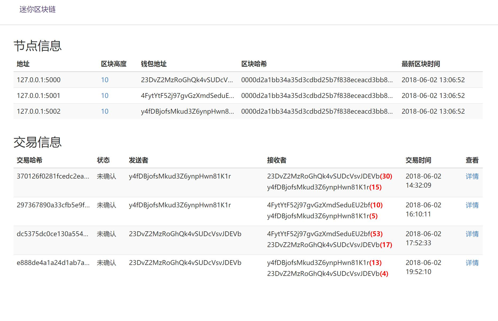
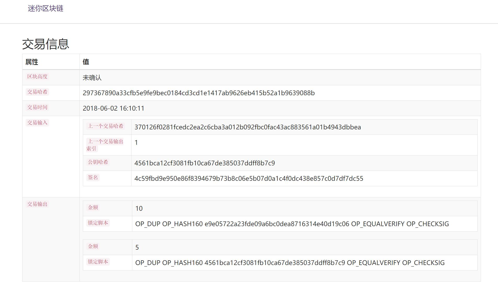
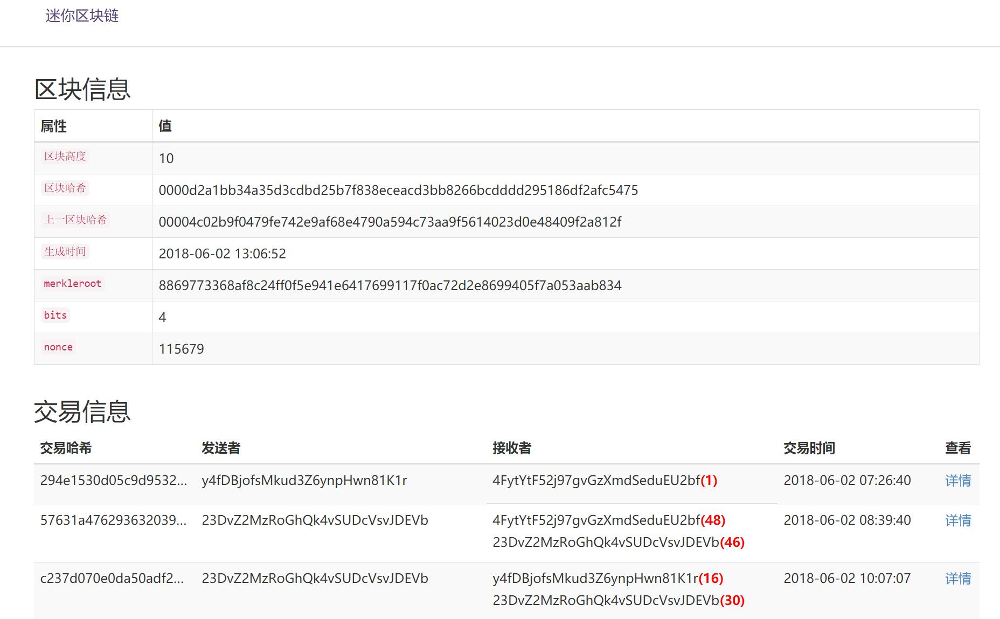

# 迷你区块链（mini blockchain in python）

------
## 一、介绍

该项目主要是通过实践的方法来加深学习和理解区块链的相关原理知识，覆盖区块链的所有核心功能：
> * 网络节点通讯
> * 挖矿
> * 钱包
> * 交易和验证
> * 共识机制
> * 链式结构

涉及的如下知识点：

> * 密码学基础
> * 数字证书
> * Merkle树和SPV机制
> * Kademlia算法、P2P技术
> * 区块链共识机制
> * 比特币交易原理
> * 区块链网络设计

参考我写的文章：[区块链学习指南](https://shuwoom.com/?p=916)





## 二、项目组成
1、迷你区块链客户端
2、迷你区块链浏览器（独立）

## 三、使用方法

### **Step1：启动迷你区块链客户端（模拟3个节点）**
测试demo中一共使用3个节点，大家可以根据需要自己调节。

python run.py -p 5000 &

python run.py -p 5001 &

python run.py -p 5002 &

------

### **Step2：模拟交易**
执行：python simulation_test.py

模拟节点之间的交易行为，启动后大家可以看到有交易输出。

------

### **Step3：迷你区块链的json api接口调用**
区块链客户端实现了json api，可以直接通过api调用来获取各个节点之间的信息：
（1）获取区块链高度

请求：

http://127.0.0.1:5001/height

返回：

{"code": 0, "value": 2}

（2）获取钱包余额

请求：

http://127.0.0.1:5001/balance?address=3Q7KKThJr5qcT7hM189AkVtqYLS8

返回：
```
{                                            

   "address": "3Q7KKThJr5qcT7hM189AkVtqYLS8", 
  "balance": 24                              
} 
```

（3）获取区块信息

请求：

http://127.0.0.1:5001/block_info?height=1

返回：
```
{                                                                                   
  "current_hash": "00003b4ff8851ab57625b8d6a432c9288659ce91f52a5b1854b37a34c07ffee8",
  "difficulty": 4,                                                                  
  "index": 0,                                                                        
  "merkleroot": "24b486df77c70ba076f92e1ccd078f8073d596c73a29baf0a8f3aea948a54815",  
  "nonce": 7534,                                                                     
  "previous_hash": "00000000000000000000000000000000000000000000000000000000000000", 
  "timestamp": 1496518102,                                                           
  "transactions": [                                                                  
    {                                                                                
      "amount": 0,                                                                   
      "receivers": [                                                                 
        {                                                                            
          "receiver": "23DvZ2MzRoGhQk4vSUDcVsvJDEVb",                                
          "value": 100                                                               
        }                                                                            
      ],                                                                             
      "senders": [],                                                                 
      "timestamp": 1496518102,                                                       
      "txid": "ab9d943d8c126189f80484a0c8ade846038797968bf90fd1ed9e88f2f46f54fa"     
    }                                                                                
  ]                                                                                  
}           
```
（4）创建一笔交易
请求：
http://127.0.0.1:5000/transactions/new
```
{
    'amount': 1, 
    'sender': u'23DvZ2MzRoGhQk4vSUDcVsvJDEVb', 
    'receiver': u'2dgzLQJgWKhdt3ETnf3tFA9m4ZpK'
}
```
返回：
```
{
    "message": "new transaction been created successfully!",
    "current_transactions": [
        {
            "timestamp": 1538373019,
            "txouts": [
                {
                    "value": 30,
                    "scriptPubKey": [
                        "OP_DUP",
                        "OP_HASH160",
                        "752f3a7934aa60d041250346e24b1d7a2886dbb0",
                        "OP_EQUALVERIFY",
                        "OP_CHECKSIG"
                    ]
                },
                {
                    "value": 14,
                    "scriptPubKey": [
                        "OP_DUP",
                        "OP_HASH160",
                        "ac280f709f81ec4eca086f1abfd0f3bec8baf395",
                        "OP_EQUALVERIFY",
                        "OP_CHECKSIG"
                    ]
                }
            ],
            "txins": [
                {
                    "prev_tx_out_idx": 1,
                    "pubkey_hash": "ac280f709f81ec4eca086f1abfd0f3bec8baf395",
                    "prev_txid": "2f096e332b2371cd141d1f279c35fb820e3e5256c1a071c5a49636c2fcd9be3d",
                    "signature": "e751d626ef0c147455ef0487b85f108ba56be57575f5133341e5e638dc697f94"
                }
            ],
            "txid": "8851e30bd03cd81b396df1904a17a87b89a30092a92572f7a66fce7a25a634c4"
        },
        {
            "timestamp": 1538373058,
            "txouts": [
                {
                    "value": 9,
                    "scriptPubKey": [
                        "OP_DUP",
                        "OP_HASH160",
                        "752f3a7934aa60d041250346e24b1d7a2886dbb0",
                        "OP_EQUALVERIFY",
                        "OP_CHECKSIG"
                    ]
                },
                {
                    "value": 46,
                    "scriptPubKey": [
                        "OP_DUP",
                        "OP_HASH160",
                        "4a879c658a42fc162f8cb3c740a4e0c4b63e80de",
                        "OP_EQUALVERIFY",
                        "OP_CHECKSIG"
                    ]
                }
            ],
            "txins": [
                {
                    "prev_tx_out_idx": 0,
                    "pubkey_hash": "4a879c658a42fc162f8cb3c740a4e0c4b63e80de",
                    "prev_txid": "2f096e332b2371cd141d1f279c35fb820e3e5256c1a071c5a49636c2fcd9be3d",
                    "signature": "0ff0b888d0dd468f1c6e37d1ab13d17f63747346dc0105b5e4974be71023079f"
                },
                {
                    "prev_tx_out_idx": 0,
                    "pubkey_hash": "4a879c658a42fc162f8cb3c740a4e0c4b63e80de",
                    "prev_txid": "72fb55e194e4d7dc71ab020483c61737c6a5b2e2474480cac4187f0633961423",
                    "signature": "de72585b9c7c6a47d1adc2851244232581cc5f3e0a4633d754736677bdea0a57"
                },
                {
                    "prev_tx_out_idx": 1,
                    "pubkey_hash": "4a879c658a42fc162f8cb3c740a4e0c4b63e80de",
                    "prev_txid": "3bc92a17262ce2cc1fe7f34ef946fd10e0b9667f223b697bfaf520e5f443be11",
                    "signature": "2871832295c53372ee44d9950676cb4675506676a9dce04db54e48b72b40a2b1"
                }
            ],
            "txid": "252d4e493ff514e87f3c00d9adcb635aba5f7c3b7890b7ccc1e17d73c23d1bf4"
        },
        {
            "timestamp": 1538373093,
            "txouts": [
                {
                    "value": 10,
                    "scriptPubKey": [
                        "OP_DUP",
                        "OP_HASH160",
                        "ac280f709f81ec4eca086f1abfd0f3bec8baf395",
                        "OP_EQUALVERIFY",
                        "OP_CHECKSIG"
                    ]
                },
                {
                    "value": 36,
                    "scriptPubKey": [
                        "OP_DUP",
                        "OP_HASH160",
                        "4a879c658a42fc162f8cb3c740a4e0c4b63e80de",
                        "OP_EQUALVERIFY",
                        "OP_CHECKSIG"
                    ]
                }
            ],
            "txins": [
                {
                    "prev_tx_out_idx": 1,
                    "pubkey_hash": "4a879c658a42fc162f8cb3c740a4e0c4b63e80de",
                    "prev_txid": "252d4e493ff514e87f3c00d9adcb635aba5f7c3b7890b7ccc1e17d73c23d1bf4",
                    "signature": "fc33dea5c178d38c4d98623e7a0fe881b9c6268088788b34c81b4b49a1cbe385"
                }
            ],
            "txid": "31cabe8dd4c9b7b03b9159409bc1929acbcefe361099bad5839c17cce497af8e"
        },
        {
            "timestamp": 1538373570,
            "txouts": [
                {
                    "value": 1,
                    "scriptPubKey": [
                        "OP_DUP",
                        "OP_HASH160",
                        "752f3a7934aa60d041250346e24b1d7a2886dbb0",
                        "OP_EQUALVERIFY",
                        "OP_CHECKSIG"
                    ]
                },
                {
                    "value": 35,
                    "scriptPubKey": [
                        "OP_DUP",
                        "OP_HASH160",
                        "4a879c658a42fc162f8cb3c740a4e0c4b63e80de",
                        "OP_EQUALVERIFY",
                        "OP_CHECKSIG"
                    ]
                }
            ],
            "txins": [
                {
                    "prev_tx_out_idx": 1,
                    "pubkey_hash": "4a879c658a42fc162f8cb3c740a4e0c4b63e80de",
                    "prev_txid": "31cabe8dd4c9b7b03b9159409bc1929acbcefe361099bad5839c17cce497af8e",
                    "signature": "adf76d1f32fb122fe2551b3e3059d64d9d11787f58cea37ec8e7ff1b3b540dd7"
                }
            ],
            "txid": "5bc1e91e8156710706934ee109976a71bdbac04b0d83e081844decb2a4d6ed15"
        }
    ]
}

------

```
### **Step4：迷你区块链浏览器**
当然，如果不想用接口来查看去快练心性，可以通过区块链浏览器来查看，只需将mini_blockchain下的browser文件夹移到nginx的www目录下，打开如下网址即可：
http://127.0.0.1/browser
